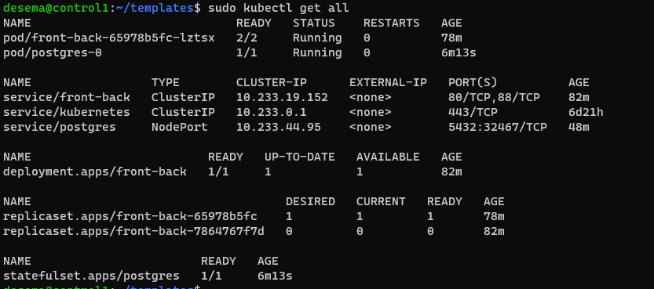

# Задание 1: подготовить тестовый конфиг для запуска приложения

Был подготовлен конфиг для фронта и бека вместе через одни деплоймент и описан сервис:
```yaml
apiVersion: apps/v1
kind: Deployment
metadata:
  labels:
    app: front-back
  name: front-back
  namespace: default
spec:
  replicas: 1
  selector:
    matchLabels:
      app: front-back
  template:
    metadata:
      labels:
        app: front-back
    spec:
      containers:
        - image: nginx
          imagePullPolicy: IfNotPresent
          name: front
        - image: praqma/network-multitool
          imagePullPolicy: IfNotPresent
          name: back
          env:
          - name: HTTP_PORT
            value: "88"


---
apiVersion: v1
kind: Service
metadata:
  name: front-back
  namespace: default
spec:
  ports:
    - name: front
      port: 80
    - name: back
      port: 88
  selector:
    app: front-back

```

Для базы данных был описан statefull set с выделением persistent volume:
```yaml
apiVersion: apps/v1
kind: StatefulSet
metadata:
  name: postgres
spec:
  serviceName: postgresql-db-service
  selector:
    matchLabels:
      app: postgres
  replicas: 1
  template:
    metadata:
      labels:
        app: postgres
    spec:
      containers:
        - name: postgres
          image: postgres:latest
          volumeMounts:
            - name: postgres-db-disk
              mountPath: /data
          env:
            - name: POSTGRES_PASSWORD
              value: testpassword
            - name: PGDATA
              value: /data/pgdata
  volumeClaimTemplates:
    - metadata:
        name: postgres-db-disk
      spec:
        accessModes: ["ReadWriteOnce"]
        resources:
          requests:
            storage: 1Gi
---
apiVersion: v1
kind: PersistentVolume
metadata:
  name: postgres-db-disk-pv
spec:
  storageClassName: ""
  accessModes:
    - ReadWriteOnce
  capacity:
    storage: 2Gi
  hostPath:
    path: /tmp/pv-pgdata
---
apiVersion: v1
kind: Service
metadata:
  name: postgres
  labels:
    app: postgres
spec:
  type: NodePort
  ports:
   - port: 5432
  selector:
   app: postgres
```
ниже вывод запущенных подов:

